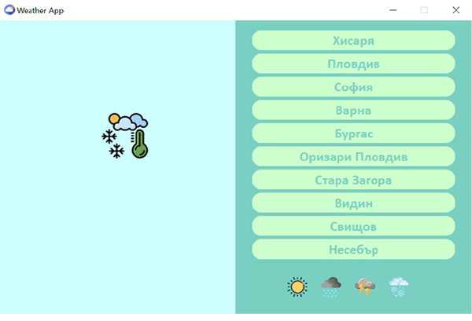

This is my app for weather forecast with selected cities.
If you want to try the app.

1. Open and create new python project.
2. Copy the code into a new python file.
3. Download the icon folder and place it in the project directory.
4. You need to install Tkinter: pip install tk.
5. And finally you need to install the rest of the used libraries by clicking on: Install packges. 
If you don't want to do all these things, you can see what the application looks like in the picture below.

